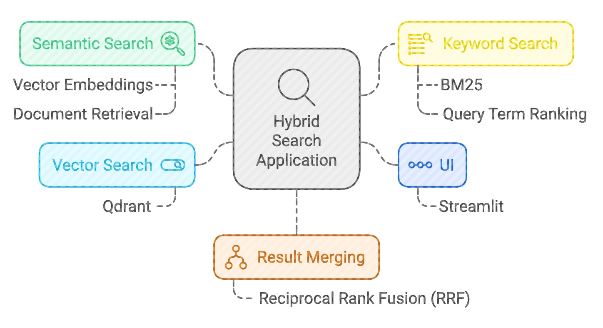

# Hybrid Search Application

This project is a hybrid search engine combining **semantic search** using vector embeddings and **keyword search** using BM25. The two results are merged using **Reciprocal Rank Fusion (RRF)**. The application is built using **Streamlit** for the UI and **Qdrant** for vector search.

## Project Structure



1. **hybrid_search_app.py**: The main script for running the Streamlit application, where the user can enter a search query to retrieve documents using both semantic and keyword search.
2. **semantic_search.py**: Implements the semantic search functionality using the Qdrant database for storing and retrieving vector embeddings generated from the documents.
3. **keyword_search.py**: Implements keyword-based search using BM25 to rank documents based on the query term.
4. **searchs_combined.py**: Combines the results of semantic and keyword searches using Reciprocal Rank Fusion (RRF) to create a hybrid search experience.

## Installation

### Prerequisites
- Python 3.8+
- Install the required Python packages:
  ```sh
  pip install streamlit qdrant-client sentence-transformers rank-bm25 numpy scipy
  ```

### Qdrant Setup
You need to have a Qdrant instance running locally or server. You can use Docker to set up Qdrant:
OR In the file semantic_search.py change to
  ```sh
 client = QdrantClient(":memory:")
 ```

### Usage
1. Running the Hybrid Search Application
To start the Streamlit app, run the following command:
  ```sh
  streamlit run hybrid_search_app.py
 ```

This will launch the web interface for the hybrid search engine. You can enter a search query, and the system will:
  1. Perform semantic search using vector embeddings.
  2. Perform keyword search using BM25.
  3. Combine the results using Reciprocal Rank Fusion (RRF) and display them.

### Example:
Here’s an example of how the application works in the Streamlit app:

  1. Input: Enter a search query, e.g., "Artificial Intelligence".
  2. Semantic Search: Retrieves documents that semantically match the meaning of the query.
  3. Keyword Search: Retrieves documents based on keyword matching with BM25.
  4. Combined Results: Both results are fused together using RRF to provide the best overall ranking.

  ### Note: 
  This is an example to understand how hybrid search works. Instead of using a simple document array as shown here, you can extend the functionality to work with text files, PDFs, Excel files, and more.
